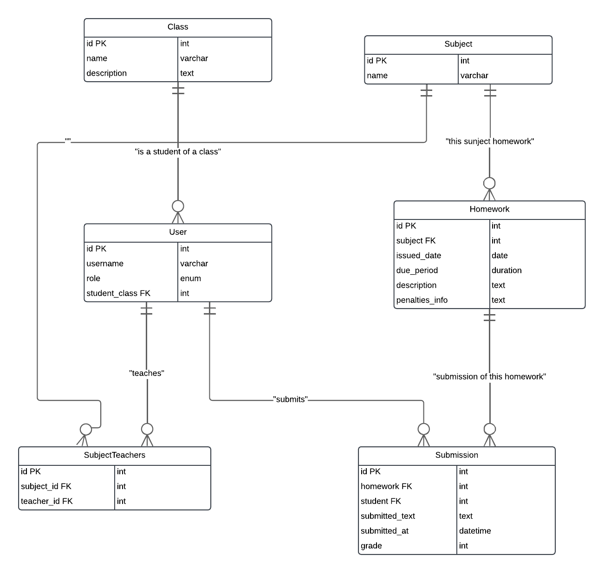

## Построение Entity Relationship Diagram
Данный проект представляет собой образовательную платформу, на которой преподаватели могут назначать домашние задания, а студенты — загружать свои ответы для последующей проверки и оценки. В проекте используются модели для пользователей, классов, предметов, домашних заданий и решений. Управление ролями и правами пользователей реализовано с помощью ORM Django и наследования от `AbstractUser`.


## Модели

### `Class`

Модель `Class` описывает школьный класс или учебную группу студентов.

- **Поля:**
  - `name`: Название класса (например, "10А").
  - `description`: Краткое описание класса.
- **Связи:**
  - Один ко многим с `User` через поле `student_class` в модели `User`.
  - Многие ко многим с `Homework`, показывая, какие классы получают конкретные домашние задания.
- **Методы:**
  - `__str__`: Возвращает название класса для удобства идентификации.

```python
class Class(models.Model):
    name = models.CharField(max_length=100)
    description = models.TextField(blank=True, null=True)

    def __str__(self):
        return self.name
```
### `User`

Модель User расширяет стандартную модель AbstractUser для добавления пользовательских полей, специфичных для образовательной платформы.

- **Поля:**
  - `role`: Роль пользователя, либо "student" (студент), либо "teacher" (учитель).
  - `student_class`: Ссылка на модель Class, указывающая, к какому классу принадлежит студент (если применимо).
- **Связи:**
  - Многие к одному с `Class`.
- **Методы:**
  - `__str__`: Возвращает название класса для удобства идентификации.

```python
class User(AbstractUser):
    ROLE_CHOICES = [
        ('student', 'Student'),
        ('teacher', 'Teacher'),
    ]
    role = models.CharField(max_length=10, choices=ROLE_CHOICES, default='student')
    student_class = models.ForeignKey(Class, on_delete=models.SET_NULL, null=True, blank=True, related_name='students')

    def __str__(self):
        return self.username
```

### `Homework`

Модель Homework представляет собой домашнее задание для определенного предмета.

- **Поля:**
  - `subject`: Связь с моделью Subject, к которому относится задание.
  - `issued_date`: Дата выдачи задания.
  - `description`: Описание задания.
  - `penalties_info`: Информация о штрафах за просрочку или другие инструкции.
- **Связи:**
  - Один ко многим с `Subject`.
  - Многие ко многим с `Class`.
- **Методы:**
  - `__str__`: Возвращает название класса для удобства идентификации.

```python
class Homework(models.Model):
    subject = models.ForeignKey(Subject, on_delete=models.CASCADE)
    issued_date = models.DateField()
    due_period = models.DurationField()
    description = models.TextField()
    penalties_info = models.TextField(blank=True, null=True)
    classes = models.ManyToManyField(Class, related_name='homeworks', blank=True)

    def __str__(self):
        return f"{self.subject.name} - {self.description[:20]}"
```

### `Submission`

Модель Submission описывает отправленное студентом решение для конкретного домашнего задания.

- **Поля:**
  - `homework`: Связь с моделью Homework, указывающая на задание.
  - `student`: Связь с моделью User, указывающая на студента, который отправил задание.
  - `submitted_text`: Текст ответа студента.
  - `submitted_at`: Дата и время отправки ответа.
  - `grade`: Оценка
- **Связи:**
  - Один ко многим с `Homework`.
  - Один ко многим с `User` для студентов.
- **Методы:**
  - `__str__`: Возвращает название класса для удобства идентификации.
- **Права:**
  - `can_grade_submissions`: Разрешение, позволяющее оценивать отправленные задания.
  - 
```python
class Submission(models.Model):
    homework = models.ForeignKey(Homework, on_delete=models.CASCADE)
    student = models.ForeignKey(User, on_delete=models.CASCADE, limit_choices_to={'role':'student'})
    submitted_text = models.TextField()
    submitted_at = models.DateTimeField(auto_now_add=True)
    grade = models.IntegerField(blank=True, null=True)

    def __str__(self):
        return f"Submission by {self.student} for {self.homework}"

    class Meta:
        permissions = [
            ('can_grade_submissions', 'Can grade submissions'),
        ]
```
## Бизнес-логика

Система разделяет пользователей на два типа:

- Студенты имеют доступ к списку домашних заданий, которые они могут выполнить и отправить через форму.
- Учителя могут добавлять и редактировать задания, а также проверять и оценивать работы студентов.

## Домашние задания и отправки

- Домашние задания создаются учителями и назначаются на определенные классы, которые получают доступ к заданиям.
- Отправки представляют собой ответы студентов на домашние задания. Учитель может проверить и поставить оценку за каждую отправку.